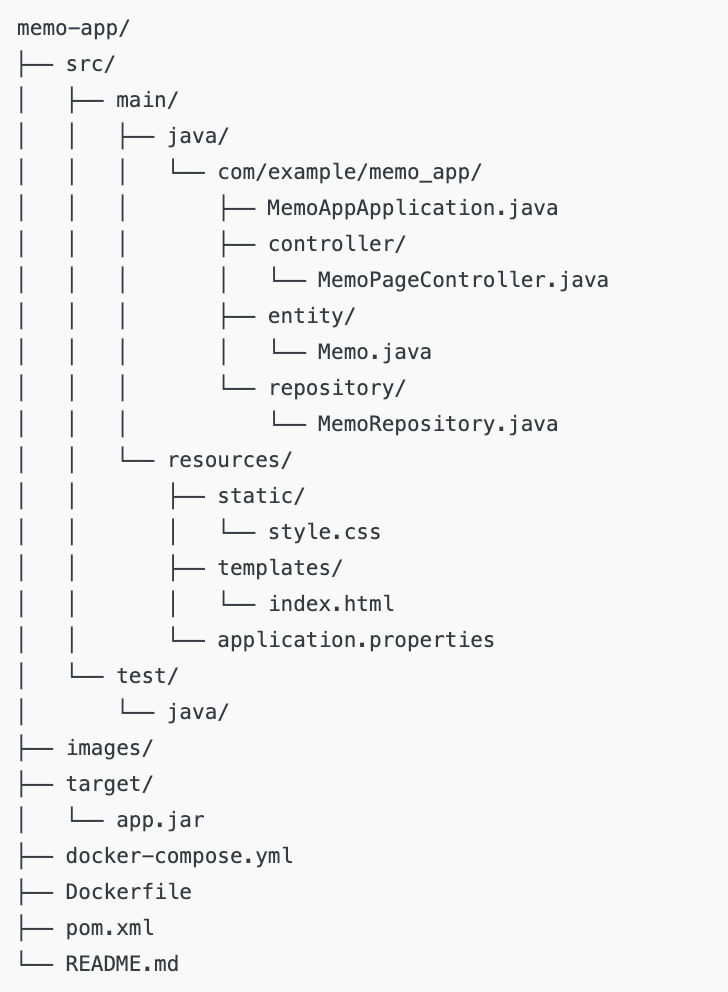
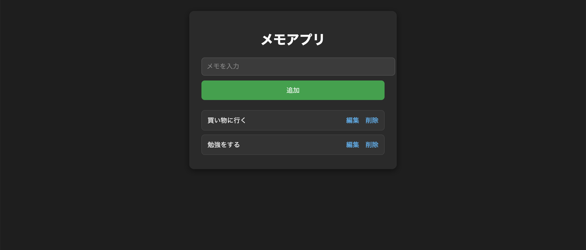

# 📘 Spring Boot メモアプリ（学習用）

Spring Boot（MVC）・Thymeleaf・MySQL・Docker Compose を学習するために作成したメモアプリです。  
1画面で「追加・編集・削除」ができる、シンプルな CRUD アプリケーションです。

---

## 📌 機能一覧

- メモの追加  
- メモの編集（同一画面で切り替え）  
- メモの削除  
- ダークモード UI（CSS 分離）  
- Thymeleaf を使用したテンプレートレンダリング  
- Docker Compose による MySQL + アプリ構成  

---

## 🛠 使用技術

### Backend
- Java 17  
- Spring Boot (Spring Web / Spring Data JPA / Thymeleaf)

### Frontend
- HTML + Thymeleaf  
- CSS（外部ファイル化）

### Database
- MySQL 8.0（Docker）

### DevOps / Others
- Docker / Docker Compose  
- Maven  

---

## 📂 フォルダ構成



---

## ▶️ 起動方法（Docker Compose）

### 1.準備

Docker Desktopをインストールする

ダウンロード：https://www.docker.com/products/docker-desktop/

### 2.プロジェクトを取得

ターミナル、コマンドプロンプトで実行

```
git clone https://github.com/naoki9873/memo-app.git
```

### 3.Docker Composeで起動

ターミナル、コマンドプロンプトで実行

```
docker compose up -d --build
```

### 4.アクセス

http://localhost:8080/

### 5.停止したいとき

```
docker compose down
```

### 6.他のデバイスでもアクセスする

①ローカルIPを調べる

②他のデバイスで

http://<PCのIP>:8080/

と入力するとアクセスできる。

---

## 💡 画面イメージ



---

## 🎯 学習ポイント

- Spring Boot MVC の基本理解  
- Thymeleaf によるテンプレート表示  
- CRUD 実装フロー（Controller → Repository → DB）  
- Docker Compose を使った DB + アプリ構築  
- 外部 CSS を読み込んだ画面デザインの実装  

---

## 🚀 今後の拡張案

- タグ機能 / カテゴリ機能  
- 検索バー追加  
- バリデーション（空文字禁止など）  
- REST API バージョンの別実装  
- フロントを React に置き換える  
- ダーク・ライト切り替え  

---

## 🧑‍💻 作者

Naoki  
（学習記録用 / 個人開発用）

---
